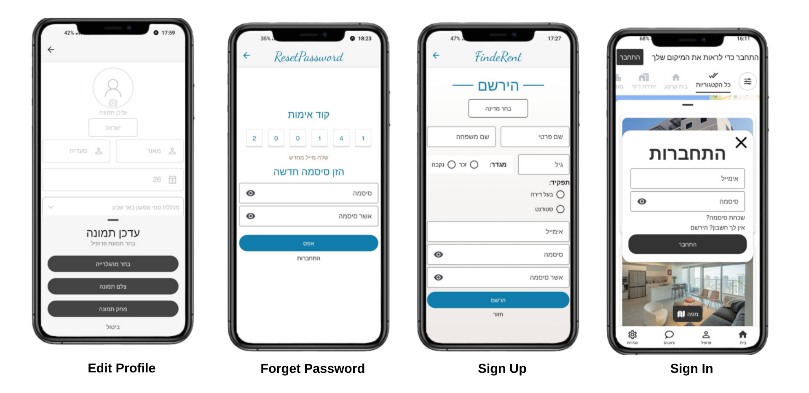
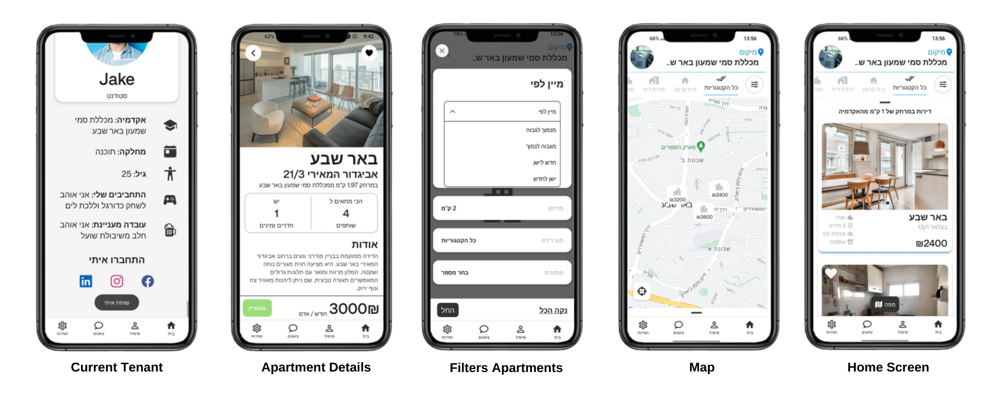
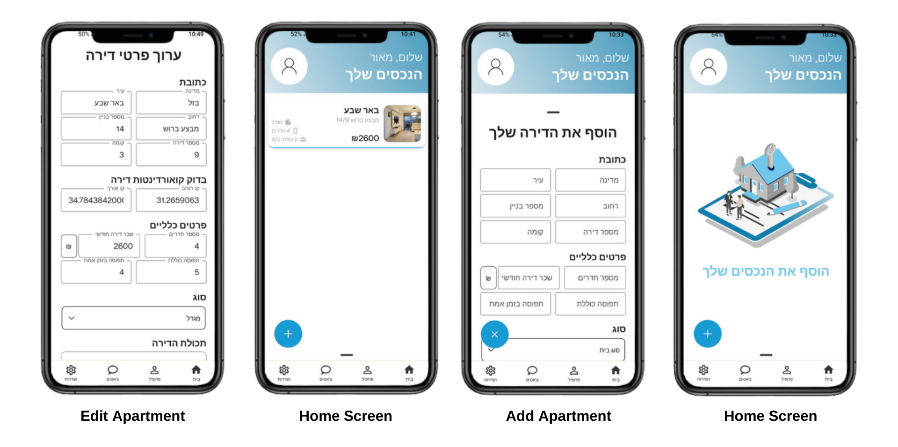
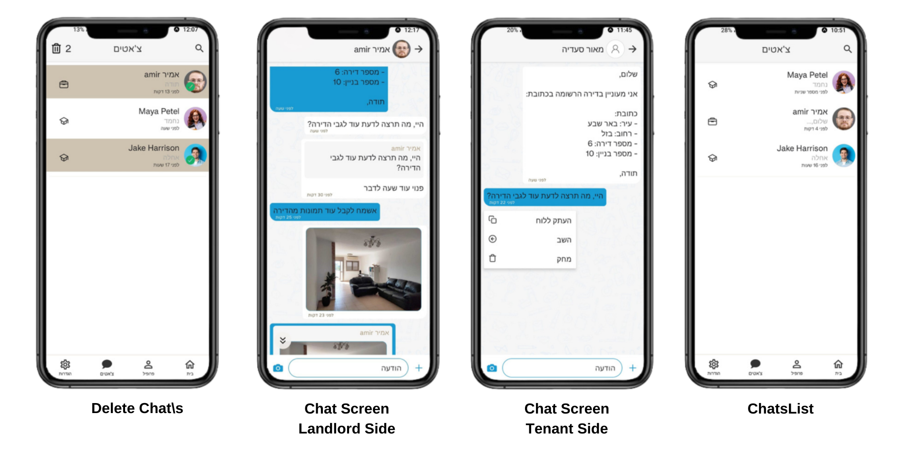
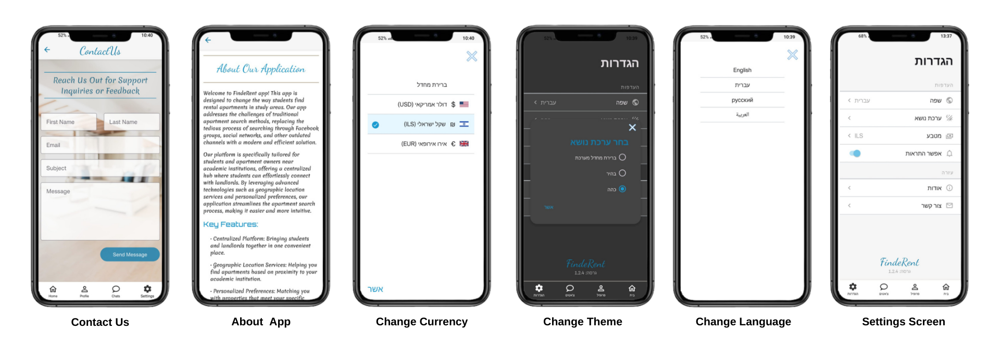

# FindeRent APP

## Overview

FindeRent is a mobile app platform developed as a final project at SCE College. It connects students with landlords to streamline apartment searches near academic institutions. The app integrates the Google Maps API to provide interactive maps and detailed property listings, enhancing the user experience and facilitating informed decisions. Additionally, it features real-time chat functionality using Socket.io, fostering instant communication between users and facilitating prompt responses.

## Features

- **📍 Interactive Maps:** Integrated Google Maps API to show properties on a map, with details and navigation options.
- **🏠 Detailed Property Listings:** Comprehensive property descriptions, photos, and landlord information.
- **💬 Real-Time Chat:** Instant messaging between students and landlords using Socket.io for prompt communication.
- **🔍 Personalized Preferences:** Matching you with properties that meet your specific needs and preferences.
- **🌟 User-Friendly Interface:** Ensuring a smooth and enjoyable search experience.
- **🛋️ Comfortable User Experience:** Simplifying the process of finding the perfect apartment.
- **🔐 User Authentication:** Secure login and registration using JSON Web Tokens (JWT).

## Technologies Used

- **📱 Mobile Applications:** React Native
- **🖥️ Backend:** Node.js, Express.js,
- **🗄️ Database:** MongoDB, Mongoose,
- **🔄 Real-Time Communication:** Socket.io
- **🔄 State Management and Data Fetching:** React Query
- **🧪 Testing:** Jest, Unit Testing
- **📦 Version Control:** GitHub
- **🔑 Authentication:** JSON Web Token (JWT)
- **☁️ Cloud Services:** Cloudinary

## App Screenshots

   <h3 style="font-size: 36; font-weight: bold;">
      SignUp And EditProfile
   </h3>
   

   <h3 style="font-size: 36; font-weight: bold;">
      Tenant Side
   </h3>
   

   <h3 style="font-size: 36; font-weight: bold;">
      LandlordSide
   </h3>
   

   <h3 style="font-size: 36; font-weight: bold;">
      Chats
   </h3>
   

   <h3 style="font-size: 36; font-weight: bold;">
     Settings
   </h3>
   

## App Demo

  

## Built With

  <table style="width: 100%; border-collapse: collapse;">
    <tr>
      <td style="border: none; text-align: center; padding: 10px;">
        
      </td>
      <td style="border: none; text-align: center; padding: 10px;">
        
      </td>
      <td style="border: none; text-align: center; padding: 10px;">
        
      </td>
      <td style="border: none; text-align: center; padding: 10px;">
        
      </td>
    </tr>
    <tr>
      <td style="border: none; text-align: center; padding: 10px;">
        
      </td>
      <td style="border: none; text-align: center; padding: 10px;">
        
      </td>
      <td style="border: none; text-align: center; padding: 10px;">
        
      </td>
      <td style="border: none; text-align: center; padding: 10px;">
        
      </td>
    </tr>
  </table>

